# 2D Recognition - Week 10 Group 1

Our group covered the following object detection models and papers:

* Faster R-CNN: [Faster R-CNN: Towards Real-Time Object Detection with Region Proposal Networks](https://arxiv.org/abs/1506.01497), Ren, He, Girshick, Sun; 2015
* YOLOv1: [You Only Look Once: Unified, Real-Time Object Detection](https://arxiv.org/abs/1506.02640), Redmon, Divvala, Girshick, Farhadi; 2015
* RetinaNet: [Focal Loss for Dense Object Detection](https://arxiv.org/abs/1708.02002), Lin, Goyal, Girshick, He, Dollár; 2017
* Mask R-CNN: [Mask R-CNN](https://arxiv.org/abs/1703.06870), He, Gkioxari, Dollár, Girshick; 2017

## Dataset 
The following 2D Recognition datasets were used:
* PASCAL VOC 2007 
* PASCAL VOC 2008 
* PASCAL VOC 2012
* COCO 2014

Here are some example annotated images from the training dataset:

It should be noted here that PASCAL VOC 2008 contains ~700 images from the 2007 dataset. Similarly, the VOC 2012 dataset contains training examples from the VOC 2007-2011 datsets. Since the goal is 2D recognition, the segmentation task is not studied here. We evaluated all models on object detection using mean AP as the metric. Refer to the official [Pascal VOC Challenge documentation](http://host.robots.ox.ac.uk/pascal/VOC/voc2012/devkit_doc.pdf) for how this mean AP is calculated.

### Hardware
All experiments on the VOC dataset were performed on Colab, the UT CS cluster and a lab desktop with Intel I9-10900KF and NVIDIA RTX 3080 GPU.

----
## 2D image recognition using fasterRCNN architecture

### Training

For all the VOC experiments, the fasterRCNN used a vgg16 as the fastRCNN model. For the COCO experiment, the vgg16 model made the training unstable and the losses diverged to NaN's, low learning rates of (0.00001) were stable but not practical for learning. 

Resnet101 was found to do better and was stable during the training process. Due to memory limitations on my desktop, the batch size for all datasets is 1, i.e. BATCH_SIZE=1

Resnet101 was used for the COCO experiments alone. Training on COCO 2014 was really slow (~11 hrs) per epoch (160k iterations) on my machine. So the training was truncated at 100k iterations.

The region proposal network (RPN) is a CNN that is also trained to learn the proper region proposals. The 4 step alternating training strategy is used to train the model here. A stochastic gradient descent (SGD) with learning rate (lr) of 0.001 was used for all results shown here.

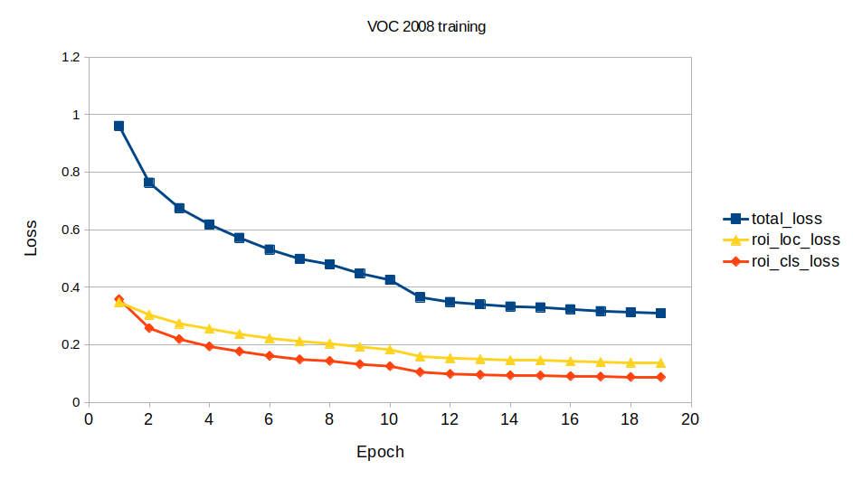

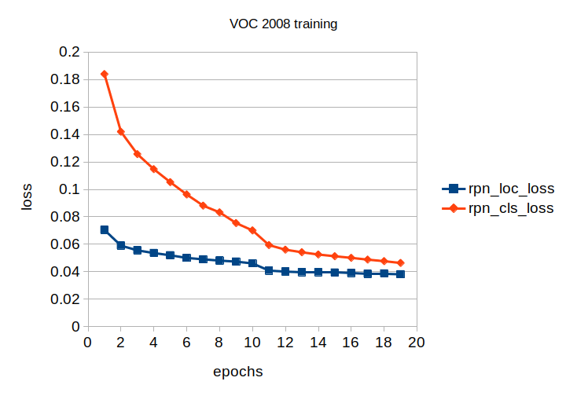

### Testing

The test dataset for VOC 2007 was readily available and the mAP could be calculated over the given set. However for the VOC 2008 and 2012 datasets, the test dataset was missing annotations to seveal test images. To resolve this we sampled 1000 random samples from the validaton set and used as testing for VOC 2008 and VOC 2012.

For COCO 2014, the 5000 test images were used. Since each epoch has 164k iterations, doing only 100k iterations doesn't provide a great mAP score, hence it is not reported here.

Demonstration of how the network learning evolves

### Summary

The network was successfully trained on VOC 2007, 2008 and 2012 datasets. Due to hardware constraints, the COCO dataset training couldn't be completed, but given enough time the plot trends showed convergence and that the model was learning. Pre-training greatly reduces the training time in all cases. 

----
## You Only Look Once (V1)

Coder: Jay Liao, jl64465

This work covers the model used in [You Only Look Once: Unified, Real-Time Object Detection](https://arxiv.org/abs/1506.02640). The code and training and testing commands can be found in `src/yolo`.

### Backbone Variations
In the paper, the authors pre-trained the first 20 convolutional layers of YOLOv1 on ImageNet until the layers reached 88% accuracy on the Image Recognition task. This pre-training procedure took a week, which is not affordable in my case. Instead, I used the following set of backbones in my experiments:
* Un-trained first 20 convolutional layers of YOLOv1, denoted simply as YOLOv1
* Pre-trained VGG11
* Pre-trained VGG16
* Pre-trained ResNet18
* Pre-trained ResNet50

The pre-trained models are trained on the ImageNet Classification task. These models are chosen based on the number of layers they had, and that they all achieved higher than 88% accuracy on the Image Recognition task on ImageNet. I also tested the original un-trained layers to see if the pre-training impacted performance.

More information about these pre-trained models can be found on the [torchvision documentation](https://pytorch.org/vision/stable/models.html).

### Hyperparameters
Every model is supposed to be trained for 70 epochs using SGD with learning rate of 0.001. The learning rate drops to 0.0001 at 40 epochs and to 0.00001 at 55 epochs. A linear learning rate warm up scheduler is applied so that the learning rate increases linearly from 0.0001 to 0.001 in the first few epochs.

For the training criterion, I used the YOLOv1 loss as described in the paper. As per the paper's configurations, `B` = 2 and `S` = 7 for the model.

The mAP reported by my models are found to be half as much as the mAP reported in the original paper. This is due to the original paper used a train set that contained both the VOC2007 and the VOC2012 train and validation sets, and evaluated their results on the VOC2012 test set. Instead of that, I trained and validated the models on each of the training set and evaluated the model on the corresponding test set. For example, for just the VOC2007 dataset, I used only the VOC2007 train set for training, only the VOC2007 validation set for validation, and only the VOC2007 test set for testing. Because my training had less samples and is also trained for less epochs, the reported mAPs are expected to be much lower.

### Results

I trained the models on the VOC2007 for 70 epochs. Since the VOC2012 dataset is much larger than both, I managed to train the models on it for at least 40 epochs. The models on the VOC2008 dataset are trained for at least 40 epochs as well.

Here's a summary of the results:

| Backbone | Parameters | VOC2007 Test mAP | VOC2008 Test mAP | VOC2012 Test mAP |
|----------|------------|------------------|------------------|------------------|
| YOLOv1 | ~271.7M | 0.84 | N/A | 0.0 |
| VGG11 | ~225.5M | 20.32 | 14.16 | 19.57 |
| VGG16 | ~231.0M | 22.31 | 14.83 | 21.30 |
| ResNet18 | ~227.4M | 26.28 | N/A | 28.62 |
| ResNet50 | ~253.9M | **29.72** | **16.37** | **29.10** |

Summaries of the models showed that the first linear layer in the classifier which converted the backbone features to 4096 latent features used the most amount of parameters, ~205.5M. Note, "N/A" indicates that the model did not converge and started to output NaNs.

I observed the following:
* Although the un-trained layers managed to train, they overfit heavily to the train set and do not converge on the validation set.
* ResNet architectures generally performed better than VGG architectures.
* YOLOv1 with a pre-trained ResNet50 backbone performed the best.

These trends are also reflected in the losses and mAPs:
* VOC2007

| 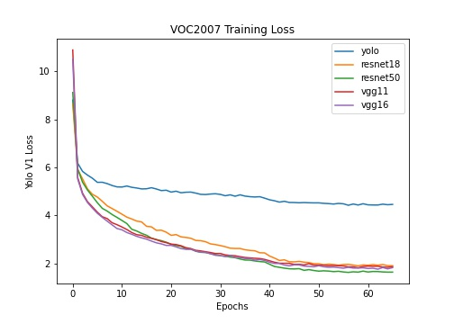 | 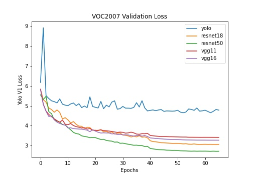 |
| - | - |
| 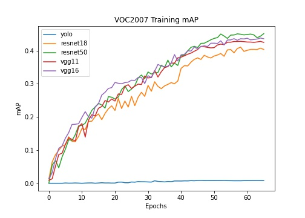 | 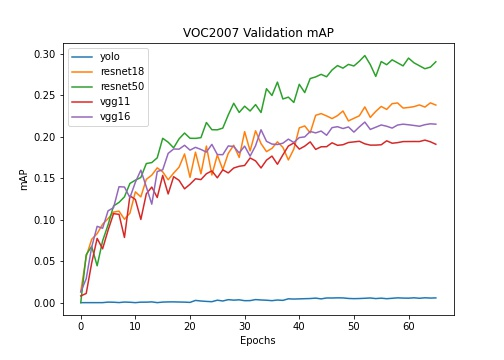 |

* VOC2008

| 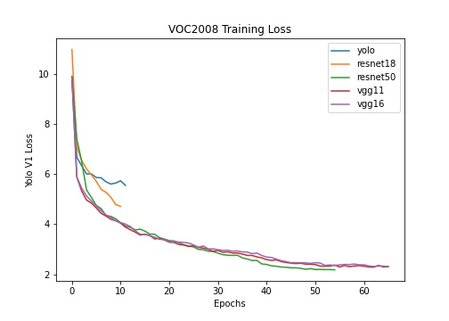 | 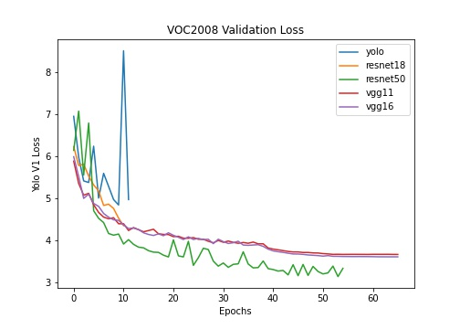 |
| - | - |
| 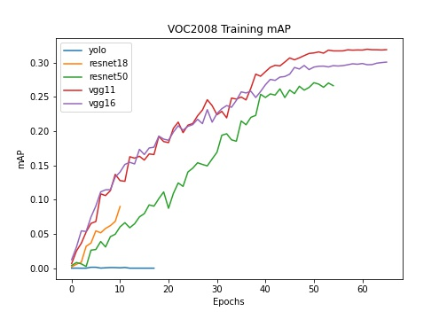 | 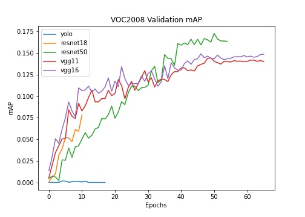 |

* VOC2012

| 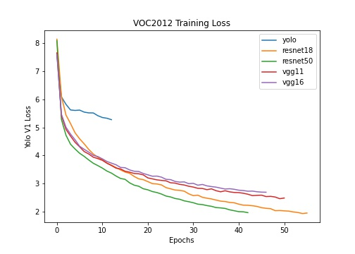 |  |
| - | - |
| 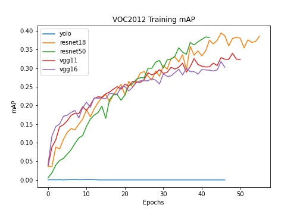 | 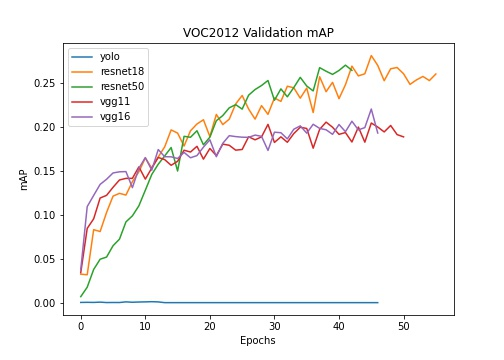 |

For a lot of the time, the YOLOv1 backbone crashed and started outputting NaNs. I also found this to happen to ResNet18 in VOC2012. Future work may wish to fine-tune the learning rate warp up and learning rate hyperparameters better to avoid these problems.

### Visualizations

Here're visualizations of how the bounding box of the model with different backbones changed during training on VOC2007:

* Training Example

| VGG16 | ResNet50 |
| - | - |
|  |  |

* Validation Example

| VGG16 | ResNet50 |
| - | - |
|  |  |

The final results on VOC2007 look like:

* Training Example

| VGG16 | ResNet50 | Ground Truth |
| - | - | - |
| 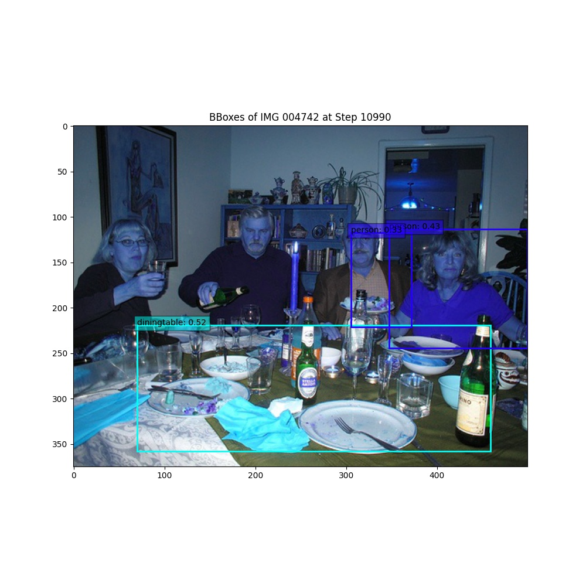 |  | 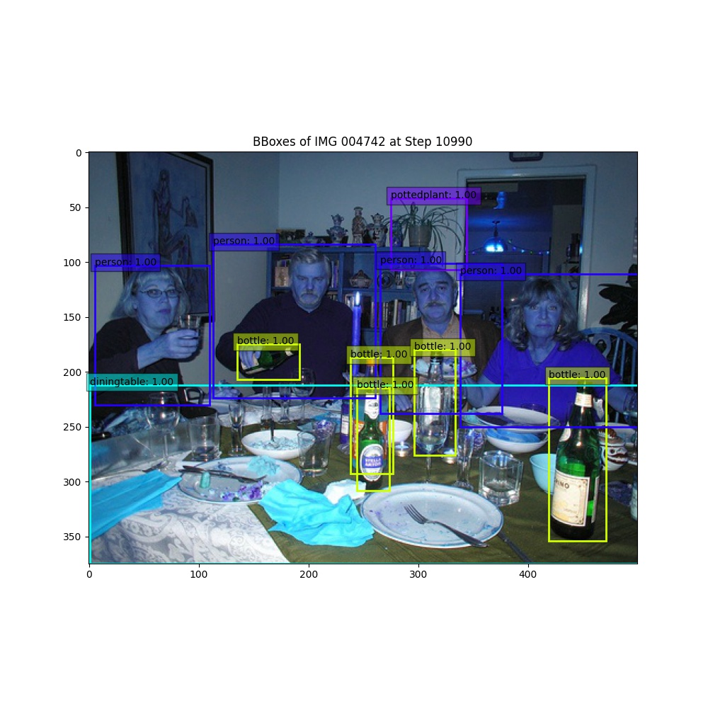 |

* Validation Example

| VGG16 | ResNet50 | Ground Truth |
| - | - | - |
|  | 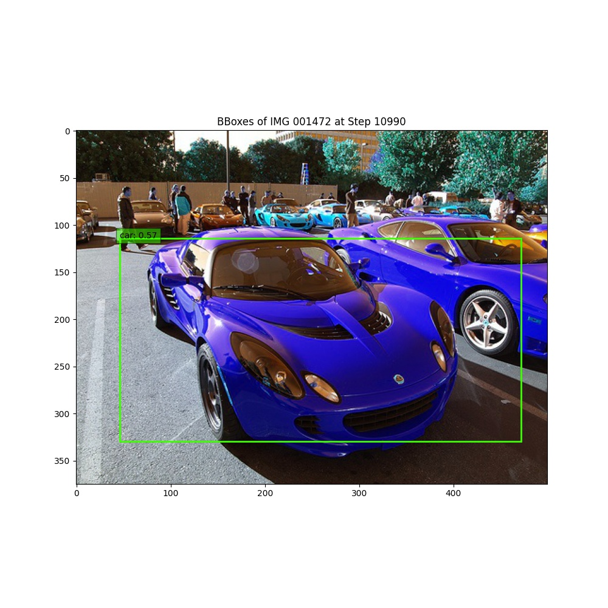 | 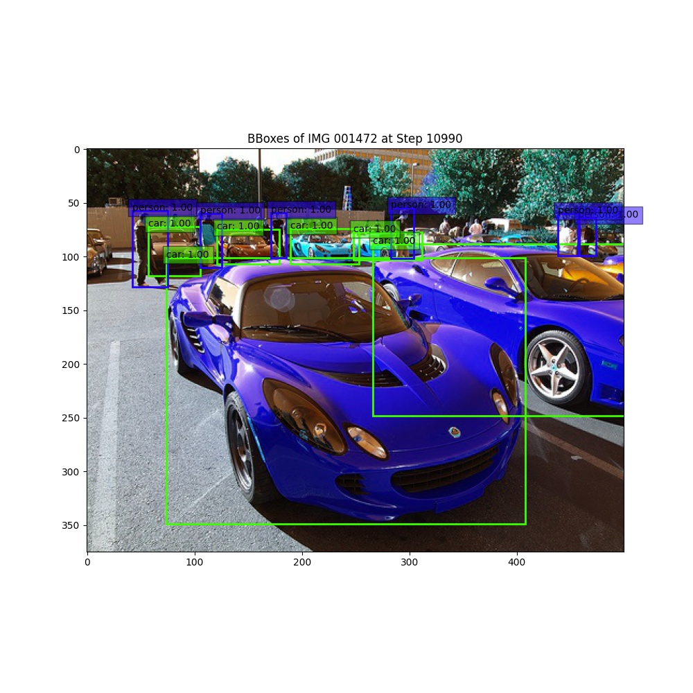 |

Generally, the models were able to find bounding boxes for some of the biggest objects. The last few epochs (with smaller learning rates) seemed to align the boxes better. The smaller objects are often not detected or filtered by the confidence threshold.

----
## RetinaNet - Focal Loss for Dense Object Detection

Coder: Elias Lampietti, ejl2425

Implementation of Tsung-Yi Lin, Priya Goyal, Ross Girshick, Kaiming He, and Piotr Dollár's [paper](https://arxiv.org/pdf/1708.02002.pdf) from 2017

This code was adapted from the RetinaNet model implemented in the Facebook AI Research library [Detectron2](https://github.com/facebookresearch/detectron2)

Notebooks that walk through this training/fine-tuning/evaluation process for the VOC 2007,2008,2012 datasets can be found [here](https://github.com/395t/coding-assignment-week-10-rec-1/tree/main/notebooks/RetinaNet)

### RetinaNet Model

The RetinaNet is a one-stage model used for object detection.
This performs much faster than two-stage models such as Mask-RCNN and Faster-RCNN as RetinaNet has a combined architecture for both detection and classification.
The Focal Loss introduced in the RetinaNet model mitigates the accuracy issue caused in one-stage models by background objects being easier to detect than foreground objects.

### Dataset

We used the PASCAL VOC [2007](http://host.robots.ox.ac.uk/pascal/VOC/voc2007/index.html), [2008](http://host.robots.ox.ac.uk/pascal/VOC/voc2008/index.html), and [2012](http://host.robots.ox.ac.uk/pascal/VOC/voc2012/index.html) datasets to fine-tune and evaluate the RetinaNet
The PASCAL VOC dataset provides standardised image data sets for object class recognition with annotations for each image.

### Data Prerequisites

Since the Detectron2 models take input data in the COCO json format, we used [roboflow](https://roboflow.com/) to convert the PASCAL VOC data into the COCO json format and make it available for public download with the following commands.

#### 2007 train/validation: 
!curl -L "https://app.roboflow.com/ds/ji2cS6UUK4?key=SCGzhDvz6i" > roboflow.zip; unzip roboflow.zip; rm roboflow.zip

#### 2007 test: 
!curl -L "https://app.roboflow.com/ds/BfERhbEO1E?key=82JnLtE0Z5" > roboflow.zip; unzip roboflow.zip; rm roboflow.zip

#### 2008 train/validation/test : 
!curl -L "https://app.roboflow.com/ds/BFV0OeJdj5?key=jeeyAa5YT9" > roboflow.zip; unzip roboflow.zip; rm roboflow.zip

#### 2012 train/validation/test: 
!curl -L "https://app.roboflow.com/ds/C6enLy92Ft?key=Mzi73TKWJ3" > roboflow.zip; unzip roboflow.zip; rm roboflow.zip

### Training

We started with the pre-trained RetinaNet model from Detectron2 and then customized it by training and fine-tuning this model for the VOC 2007, 2008, and 2012 datasets.

### Results

The total loss during training for each dataset is shown below:

These charts show that the model trains well and is able to reduce the total loss to around 0.3 for all three datasets after 1.5k iterations.

The following image displays the changes in the model's LR during training caused by a warmup LR scheduler.

The average precision (AP) for a few of the 20 classification categories is show below:

#### 2007:

#### 2008:

#### 2012:

These plots show that the model struggles on detecting the bottle object on the 2007 and 2008 datasets which are similar, however it is able to detect the bottle much better on the 2012 dataset.
These also show that all models are able to predict the boat object relatively well and the bus object very well with APs up to almost 70.

The following charts are the mean average precision (mAP) during training.

#### 2007:

#### 2008:

#### 2012:

Although each dataset shows increasing mAP, the 2007 and 2012 datasets show the greatest increase with a final mAP of around 45.

### Evaluation

After training and fine-tuning the model on the 3 datasets, we evaluated them with the mean average precision metric.
Below is a table showing how each model performed based on mean average precision for object detection of the 20 different objects.

These results show that the RetinaNet performed the best on the PASCAL VOC 2007 dataset achieving a mean average precision of 46.21.
The reason for the lower result of 31.24 in the 2008 dataset even though it is similar to the 2007 is because the provided annotations had some strange values mixed in such as "personhandheadhandfootfoot" that the model was trying to classify. 
The RetinaNet was also able to achieve good results for the PASCAL VOC 2012 dataset with a mean average precision of 43.78.

The following images show how well the RetinaNet is able to perform object detection for each VOC dataset with random test images.

#### 2007:

#### 2008:

#### 2012:

These results show that RetinaNet is able to classify vehicles better than animals as it achieves 93-94% certainty for the bus on each dataset however it fluctuates from 66% to 83% certainty for the dog with 2007 being the worst and 2008 performing the best and 2012 being average at 75% certainty.

----
## References

YOLOv1 used the following open-source repositories:
* [pytorch-yolo-v1](https://github.com/zzzheng/pytorch-yolo-v1)
* [YOLOv1-Pytorch](https://github.com/GitHberChen/YOLOv1-Pytorch)
* [pytorch-YOLO-v1](https://github.com/abeardear/pytorch-YOLO-v1)

RetinaNet:
* [Detectron2: Yuxin Wu, Alexander Kirillov, Francisco Massa, Wan-Yen Lo, and Ross Girshick, 2019](https://github.com/facebookresearch/detectron2)
* [Roboflow data loading and training tutorial: Jacob Solawetz, 2020](https://blog.roboflow.com/how-to-train-detectron2/)
