# coding-template

## Summary

This weeks paper is about 2D recognition networks, particularly:

fasterRCNN

## Dataset 
The following image classification datasets were used:
-PASCAL VOC 2007 
-PASCAL VOC 2008 
-PASCAL VOC 2012
-COCO 2014

It should be noted here that PASCAL VOC 2008 contains ~700 images from the 2007 dataset. Similarly, the VOC 2012 dataset contains training examples from the VOC 2007-2011 datsets. Since the goal is 2D recognition, the segmentation task is not studied here.

## Hardware
All experiments on the VOC dataset were performed on Colab, the UT CS cluster and a lab desktop with Intel I9-10900KF and NVIDIA RTX 3080 GPU.

## 2D image recognition using fasterRCNN architecture

## Training

For all the VOC experiments, the fasterRCNN used a vgg16 as the fastRCNN model. For the COCO experiment, the vgg16 model made the training unstable and the losses diverged to NaN's, low learning rates of (0.00001) were stable but not practical for learning. 
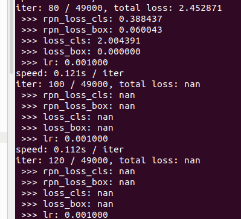

Resnet101 was found to do better and was stable during the training process. Due to memory limitations on my desktop, the batch size for all datasets is 1, i.e. BATCH_SIZE=1

Resnet101 was used for the COCO experiments alone. Training on COCO 2014 was really slow (~11 hrs) per epoch (160k iterations) on my machine. So the training was truncated at 100k iterations.

The region proposal network (RPN) is a CNN that is also trained to learn the proper region proposals. The 4 step alternating training strategy is used to train the model here. A stochastic gradient descent (SGD) with learning rate (lr) of 0.001 was used for all results shown here.

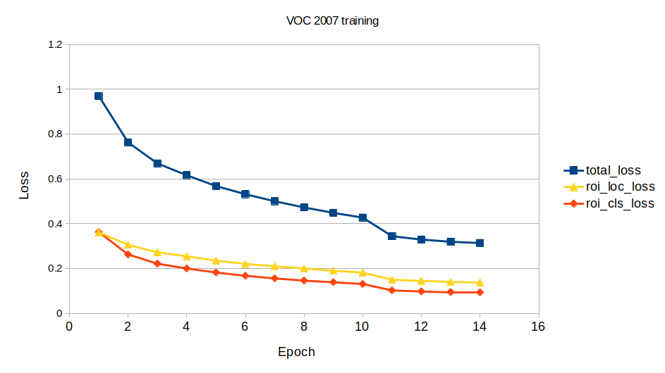

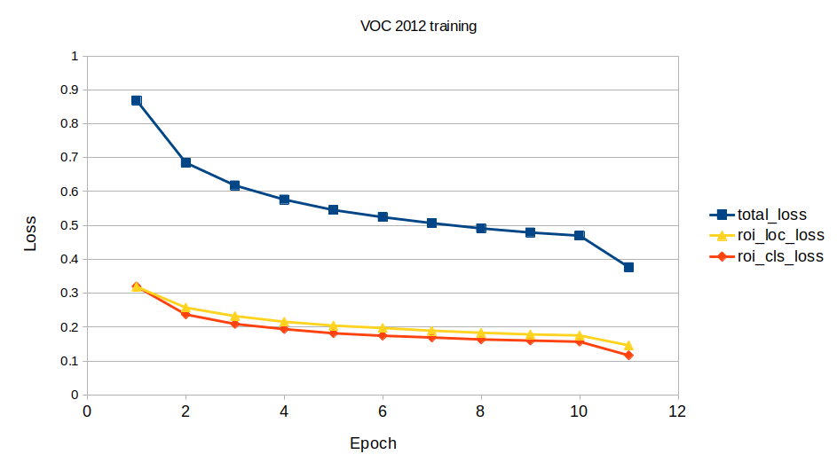

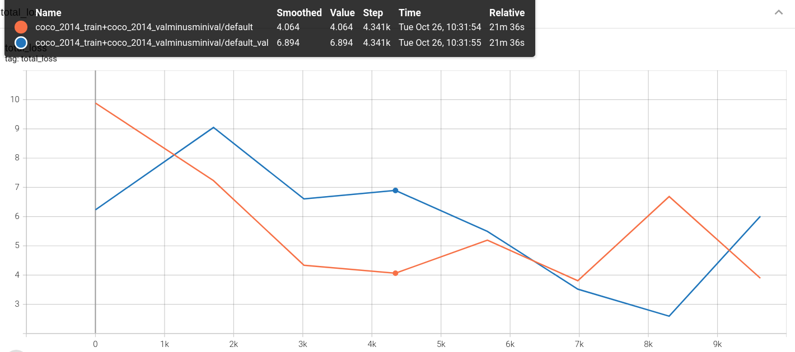

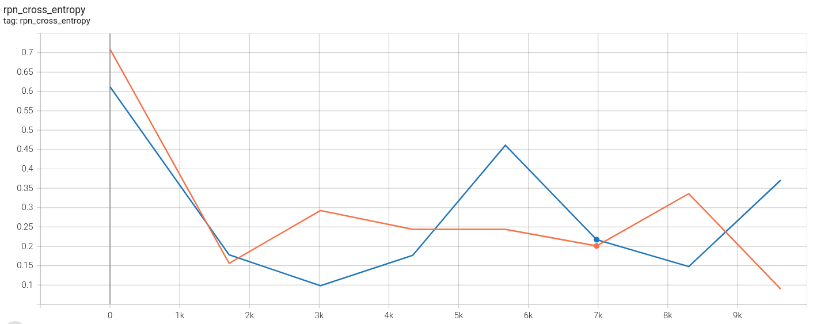

## Testing

The test dataset for VOC 2007 was readily available and the mAP could be calculated over the given set. However for the VOC 2008 and 2012 datasets, the test dataset was missing annotations to seveal test images. To resolve this we sampled 1000 random samples from the validaton set and used as testing for VOC 2008 and VOC 2012.

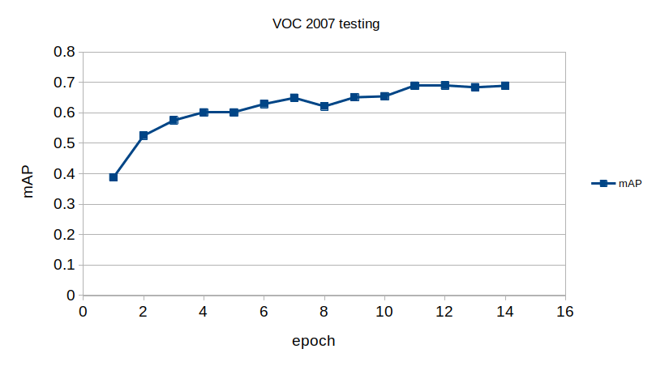

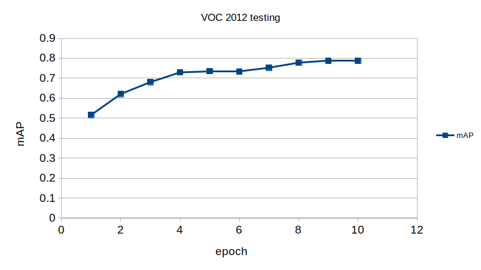

For COCO 2014, the 5000 test images were used. Since each epoch has 164k iterations, doing only 100k iterations doesn't provide a great mAP score, hence it is not reported here.

Demonstration of how the network learning evolves

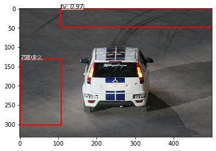
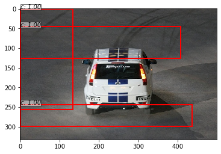
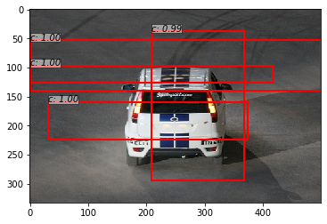
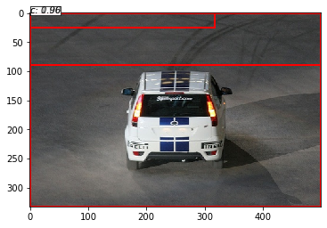
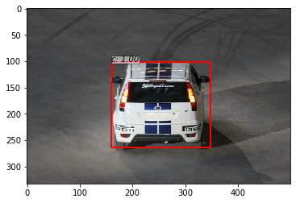

## Summary

The network was successfully trained on VOC 2007 and 2012 datasets. Due to hardware constraints, the COCO dataset training couldn't be completed, but given enough time the plot trends showed convergence and that the model was learning. Pre-training greatly reduces the training time in all cases. 

## Reference

The code shown here was largely borrowed from the github repo by @chenuntc:
https://github.com/chenyuntc/simple-faster-rcnn-pytorch

It contains a pyTorch implementation of the fast RCNN network.