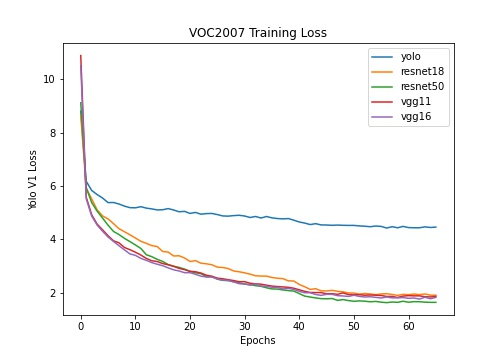
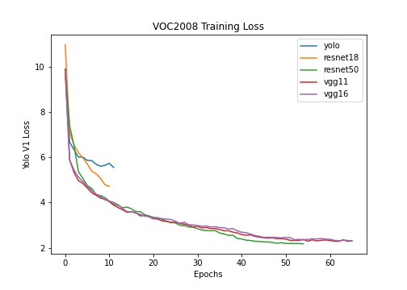
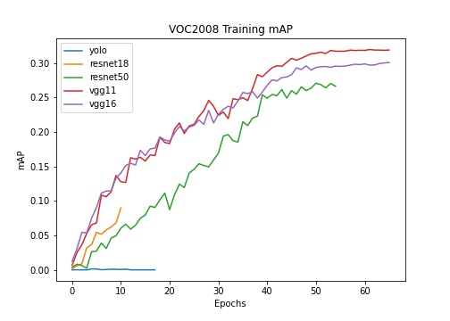
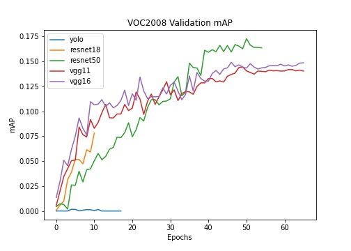
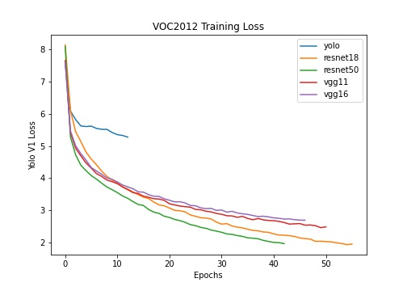
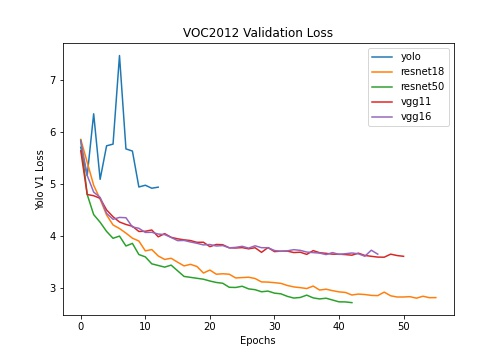
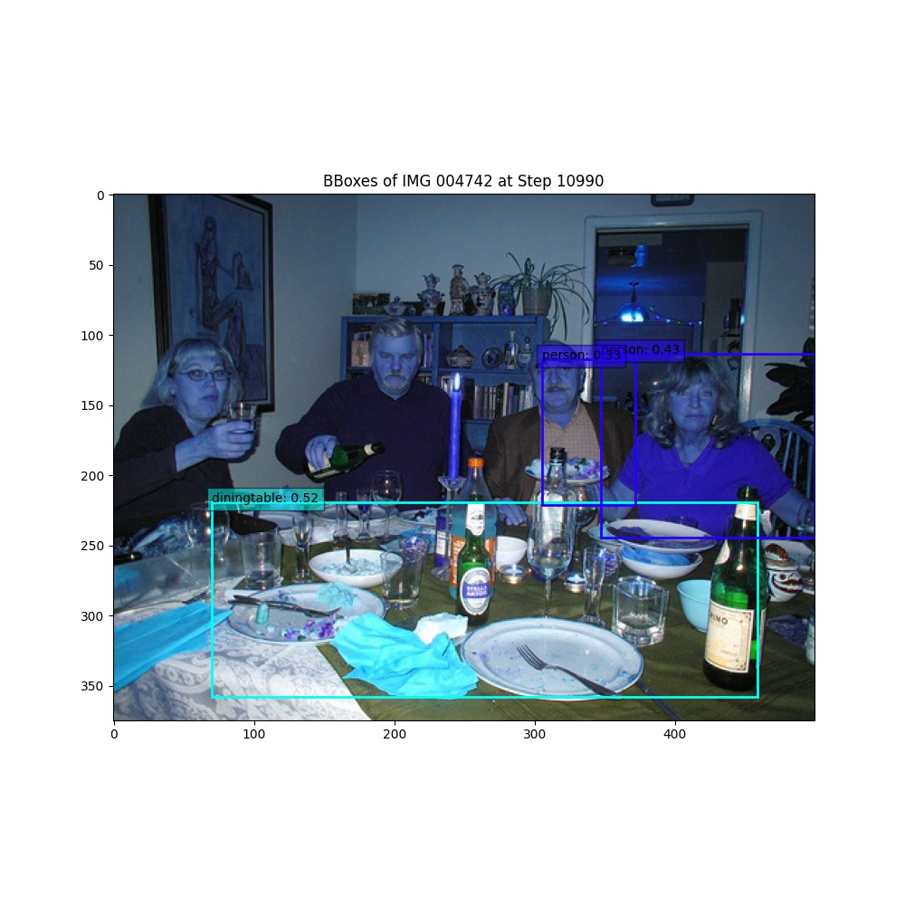
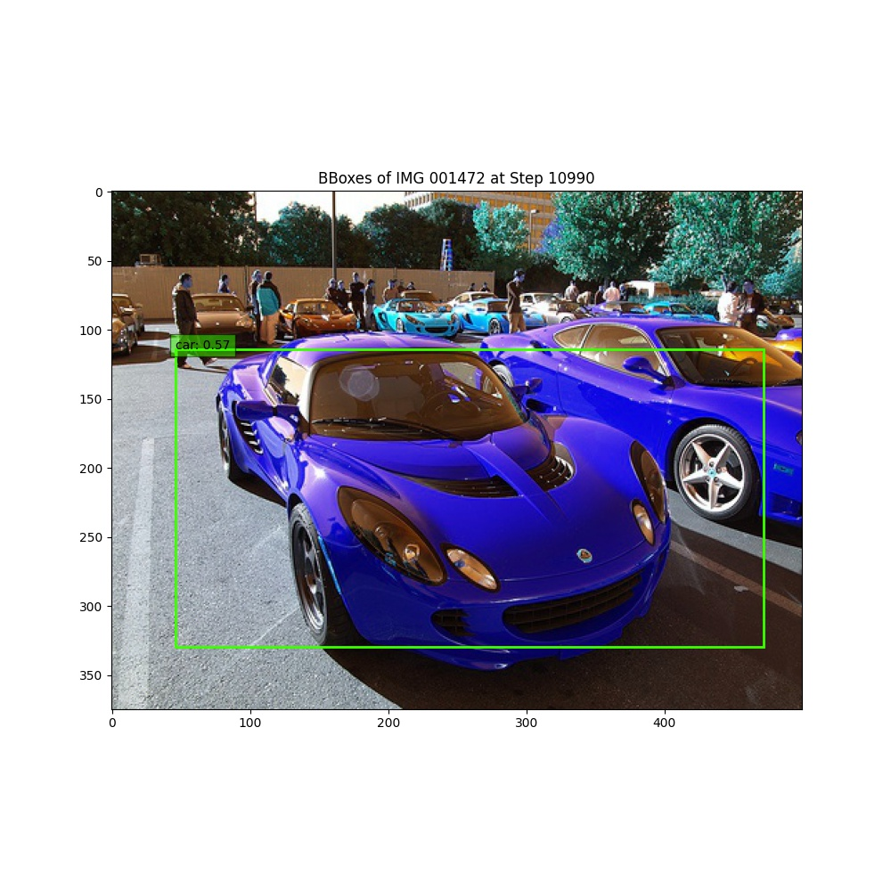

----
## You Only Look Once (V1)

Coder: Jay Liao (jl64465)

This work covers the model used in [You Only Look Once: Unified, Real-Time Object Detection](https://arxiv.org/abs/1506.02640). The code and training and testing commands can be found in `src/yolo`.

### Backbone Variations
In the paper, the authors pre-trained the first 20 convolutional layers of YOLOv1 on ImageNet until the layers reached 88% accuracy on the Image Recognition task. This pre-training procedure took a week, which is not affordable in my case. Instead, I used the following set of backbones in my experiments:
* Un-trained first 20 convolutional layers of YOLOv1, denoted simply as YOLOv1
* Pre-trained VGG11
* Pre-trained VGG16
* Pre-trained ResNet18
* Pre-trained ResNet50

These pre-trained models are chosen based on the number of layers they had and that they all achieved higher than 88% accuracy on the Image Recognition task on ImageNet. I also tested the original un-trained layers to see if the pre-training impacted performance.

### Hyperparameters
Every model is supposed to be trained for 70 epochs using SGD with learning rate of 0.001. The learning rate drops to 0.0001 at 40 epochs and to 0.00001 at 55 epochs. A linear learning rate warm up scheduler is applied so that the learning rate increases linearly from 0.0001 to 0.001 in the first few epochs.

For the training criterion, I used the YOLOv1 loss as described in the paper. As per the paper's configurations, `B` = 2 and `S` = 7 for the model.

The mAP reported by my models are found to be half as much as the mAP reported in the original paper. This is due to the original paper used a train set that contained both the VOC2007 and the VOC2012 train and validation sets, and evaluated their results on the VOC2012 test set. Instead of that, I trained and validated the models on each of the training set and evaluated the model on the corresponding test set. For example, for just the VOC2007 dataset, I used only the VOC2007 train set for training, only the VOC2007 validation set for validation, and only the VOC2007 test set for testing. Because my training had less samples and is also trained for less epochs, the reported mAPs are expected to be much lower.

### Results

I trained the models on the VOC2007 for 70 epochs. Since the VOC2012 dataset is much larger than both, I managed to train the models on it for at least 40 epochs. The models on the VOC2008 dataset are trained for at least 40 epochs as well.

Here's a summary of the results:

| Backbone | Parameters | VOC2007 Test mAP | VOC2008 Test mAP | VOC2012 Test mAP |
|----------|------------|------------------|------------------|------------------|
| YOLOv1 | ~271.7M | 0.84 | N/A | 0.0 |
| VGG11 | ~225.5M | 20.32 | 14.16 | 19.57 |
| VGG16 | ~231.0M | 22.31 | 14.83 | 21.30 |
| ResNet18 | ~227.4M | 26.28 | N/A | 28.62 |
| ResNet50 | ~253.9M | **29.72** | **16.37** | **29.10** |

Summaries of the models showed that the first linear layer in the classifier which converted the backbone features to 4096 latent features used the most amount of parameters, ~205.5M. Note, "N/A" indicates that the model did not converge and started to output NaNs.

I observed the following:
* Although the un-trained layers managed to train, they overfit heavily to the train set and do not converge on the validation set.
* ResNet architectures generally performed better than VGG architectures.
* YOLOv1 with a pre-trained ResNet50 backbone performed the best.

These trends are also reflected in the losses and mAPs:
* VOC2007

|  |  |
| - | - |
|  |  |

* VOC2008

|  |  |
| - | - |
|  |  |

* VOC2012

|  |  |
| - | - |
|  |  |

For a lot of the time, the YOLOv1 backbone crashed and started outputting NaNs. I also found this to happen to ResNet18 in VOC2012. Future work may wish to fine-tune the learning rate warp up and learning rate hyperparameters better to avoid these problems.

### Visualizations

Here're visualizations of how the bounding box of the model with different backbones changed during training on VOC2007:

* Training Example

| VGG16 | ResNet50 |
| - | - |
|  |  |

* Validation Example

| VGG16 | ResNet50 |
| - | - |
|  |  |

The final results on VOC2007 look like:

* Training Example

| VGG16 | ResNet50 | Ground Truth |
| - | - | - |
|  |  |  |

* Validation Example

| VGG16 | ResNet50 | Ground Truth |
| - | - | - |
|  |  |  |
