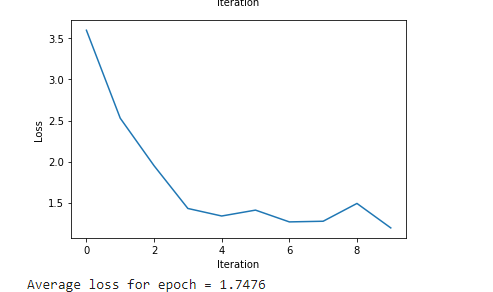
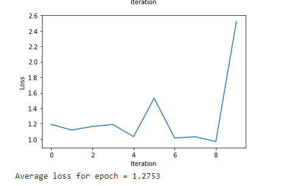
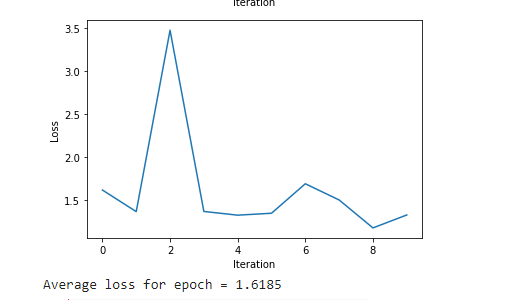
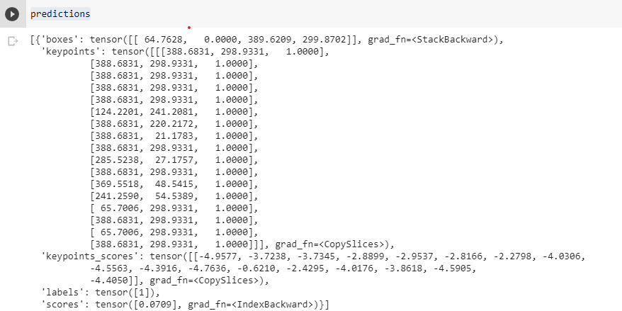

This is the coding assignment for Mask R-CNN, which was not successfully done. I used an open source code in the following link, I modified the code a little bit, and trained the Mask R-CNN model on VOC_2012, VOC_2007 datasets.  https://bjornkhansen95.medium.com/mask-r-cnn-for-segmentation-using-pytorch-8bbfa8511883  

However, when the code was running on Colab under GPU/High RAM settings, there was always one error saying that an illegal cuda memory was encountered. If I change the setting to CPU, the program runs smoothly but extremely slow. Therefore, I only trained my Mask R-CNN model on a small portion of VOC_2012 and VOC_2007 datasets for two epoches respectively. The following pictures are my results: (the first two are training loss on VOC_2007, and the last two are training loss on VOC_2012) 

  
  

  
  

I also tested my own picture on pretrained Mask R-CNN model provided by pytorch, here are the results  

  
  

